# Julian | Alpha-Auxiliary

你好，我是 Julian。欢迎来到我的 GitHub 主页。

我关注软件开发、人工智能辅助编程与工程效率提升，喜欢把想法整理成可运行、可维护、可持续迭代的项目。当前主要使用 VSCode 作为开发环境，也在持续探索 AI 工具在学习、开发和项目管理中的实际价值。

---

## 关于我

- 关注方向：AI 工具应用、开发效率、后端服务、前端工程化与自动化工作流
- 编程语言：C / C++ / Java / Python / Rust
- 前端技术：Vue / JavaScript / TypeScript / HTML / CSS
- 后端技术：Spring Boot / Node.js
- 数据库：MySQL
- 开发工具：VSCode / Git / GitHub Actions

我也对物理、电影、策略游戏和旅行保持长期兴趣。技术之外的输入，常常会反过来影响我理解问题、设计系统和表达想法的方式。

---

## GitHub 数据

  
  

这些卡片由 GitHub Actions 自动生成并缓存到本仓库，用于降低外部服务不可用时对 README 展示效果的影响。

---

## 协作与交流

如果你也关注 AI、开发工具、工程效率或有趣的软件项目，欢迎通过 GitHub 与我交流。

我希望这里不仅是代码仓库的集合，也是一份持续更新的学习记录和实践档案。
